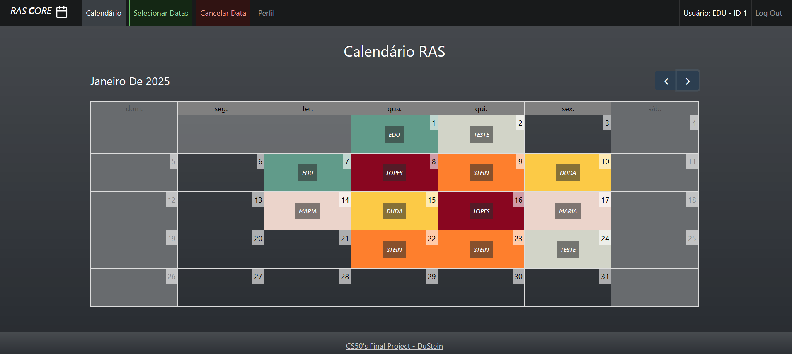
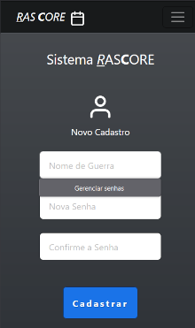
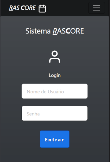
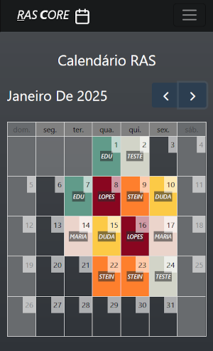
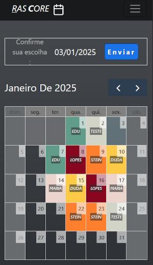
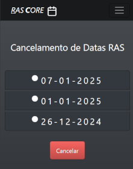
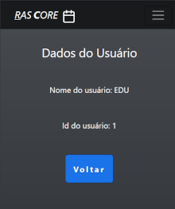

# RASCore Web App
#### Video Demo:  <URL HERE>
#### Description:

RASCore is an innovative and practical web application that solves a real-world work scheduling problem. Here's a summary of the main features and technologies of this project:
This project not only solves a specific scheduling problem but also demonstrates ability to develop complete web solutions, integrating various technologies and libraries. The transition from the CS50.dev environment to a local development setup also shows adaptability and understanding of different development configurations.

#### Core Functionality
RASCore allows registered users to efficiently schedule work days. The key features include:

- Selection of work days through an interactive calendar;
- Automatic distribution of weekdays among users;
- Simplification of the scheduling process, eliminating the need for lengthy message exchanges;

#### Technologies Used
I have employed a variety of modern technologies to develop RASCore:

- Backend: Python with Flask
- Frontend: HTML, CSS, JavaScript
- Templating: Jinja2
- Database: SQLite3 with SQLAlchemy
- Calendar Library: Fullcalendar.io

#### Development Process

- Started development on the CS50.dev platform
- Migrated to a local development machine
- Adapted SQL code to use SQLAlchemy
- Implemented and configured the Fullcalendar library
- Performed extensive CSS styling and JavaScript programming

#### Challenges and Learnings
The project presented several challenges that resulted in significant learning:

- Configuration and use of the Fullcalendar library;
- Migration from raw SQL and CS50's library to SQLAlchemy;
- Development of complex scheduling logic;
- Integration of interactive frontend with Flask backend;

#### Next Steps
I plan to deploy RASCore soon for real use in your work activities, demonstrating the practical value and applicability of the project.

Here's an organized description of your RASCore app's functionalities with corresponding screenshots:

#### RASCore App Functionalities

0. __Web Desktop Index Screen__

This application was developed with a mobile-first focus, but it is perfectly adapted with responsiveness for desktop use and current web browsers.

1. __New User Registration__

- Users provide a username and password (entered twice for verification)
- Backend verifications:
    Username is provided and unique
    Password is provided
    Password confirmation matches

2. __User Login__

- Login template for existing users
- Users enter their username and password

3. __Main Calendar View (Index)__

- Displays the current month's calendar
- Shows all scheduled dates with corresponding usernames

4. __Date Selection__

- Users can schedule work days
- Restrictions:
    Limited to weekdays only
    Only future dates can be selected
    Already scheduled dates are unavailable

5. __Cancellation Feature__

- Displays a list of days scheduled by the user
- Allows cancellation of individual scheduled days as needed

6. __User Profile__

- Displays user data:
    Username
    User ID

This organized structure clearly outlines the main features of your RASCore app, providing a comprehensive overview of its functionalities. Each section corresponds to a key aspect of the application, making it easy for users or developers to understand the app's capabilities and workflow.